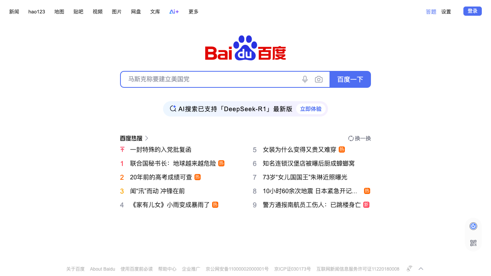
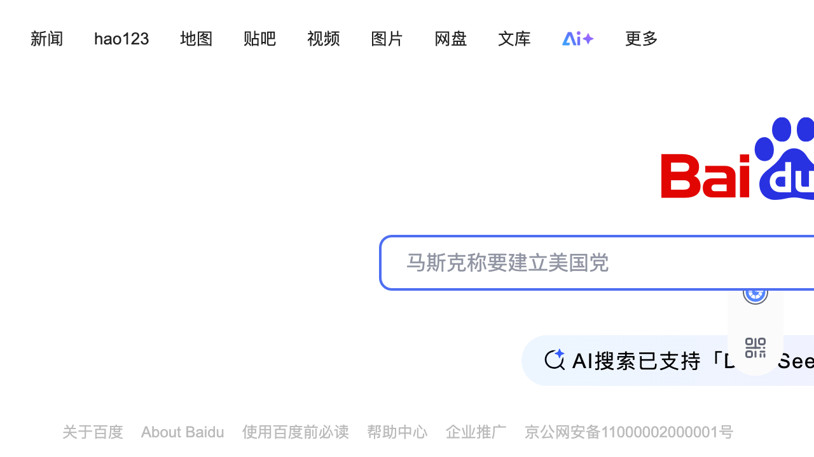

# Accessibility Report

**URL tested**: https://baidu.com/  
**Resize Percent**: 200%  
**WCAG SC**: 1.4.4 Resize Text  
**Generated At**: 2025-07-03 00:55:18

---

## ✅ Summary

- **Status**: ❌ Issues found
- **Total issues**: 2
  - ContentLoss: 1
  - HorizontalScroll: 0
  - OverlappingElements: 1

---

## 📸 Screenshots

| Before Resize | After Resize |
| -------------- | ------------- |
|  |  |

---

## 🗂️ Issues Details

### 1️⃣ Type: ContentLoss

**Description:**  
The primary search button ("百度一下") disappears when text is resized to 200%, preventing users from submitting a search.

**Suggestion:**  
Use a flexible layout (e.g., CSS Flexbox or Grid) for the search bar container. This will allow the input field and the button to reflow gracefully, for instance by wrapping the button to a new line, ensuring it remains visible and functional.


---

### 2️⃣ Type: OverlappingElements

**Description:**  
The voice search icon inside the search input field overlaps with the typed text, making part of the query unreadable.

**Suggestion:**  
Ensure there is sufficient padding within the text input to prevent its content from being obscured by other elements like icons. Using a flexible layout for the input's internal items can also help manage space dynamically.


---


## 🗄️ Raw Model Output

<details>
<summary>Click to expand raw JSON output</summary>


```json
{
  "issues": [
    {
      "type": "ContentLoss",
      "description": "The primary search button (\"\u767e\u5ea6\u4e00\u4e0b\") disappears when text is resized to 200%, preventing users from submitting a search.",
      "suggestion": "Use a flexible layout (e.g., CSS Flexbox or Grid) for the search bar container. This will allow the input field and the button to reflow gracefully, for instance by wrapping the button to a new line, ensuring it remains visible and functional."
    },
    {
      "type": "OverlappingElements",
      "description": "The voice search icon inside the search input field overlaps with the typed text, making part of the query unreadable.",
      "suggestion": "Ensure there is sufficient padding within the text input to prevent its content from being obscured by other elements like icons. Using a flexible layout for the input's internal items can also help manage space dynamically."
    }
  ]
}
```

</details>
