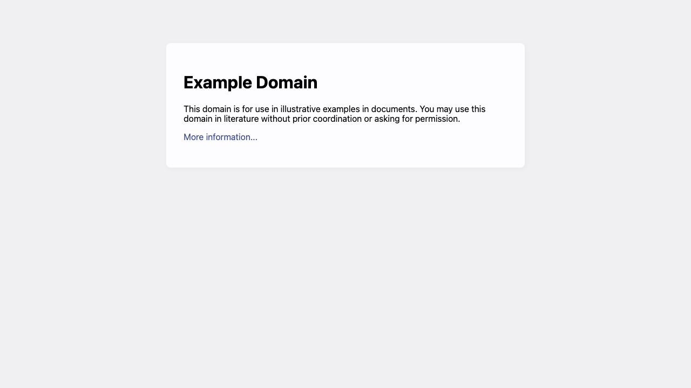
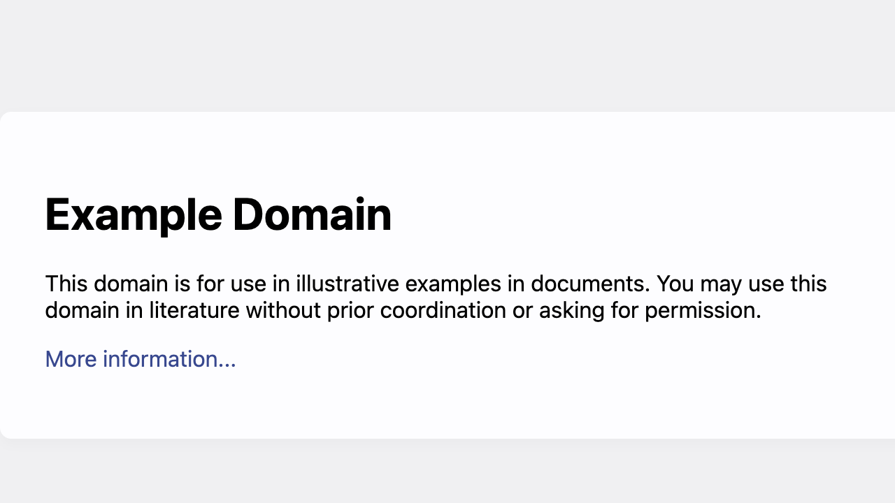

# Accessibility Report

**URL tested**: https://example.com  
**Resize Percent**: 200%  
**WCAG SC**: 1.4.4 Resize Text  
**Generated At**: 2025-07-03 01:55:46

---

## ✅ Summary

- **Status**: ✅ No issues found 🎉
- **Total issues**: 0
  - ContentLoss: 0
  - HorizontalScroll: 0
  - OverlappingElements: 0

---

## 📸 Screenshots

| Before Resize | After Resize |
| -------------- | ------------- |
|  |  |

---

## 🗂️ Issues Details

_No issues found!_ 🎉


## 🗄️ Raw Model Output

<details>
<summary>Click to expand raw JSON output</summary>


```json
{
  "issues": []
}
```

</details>
