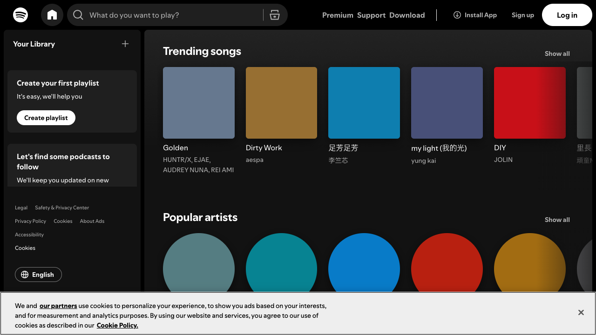
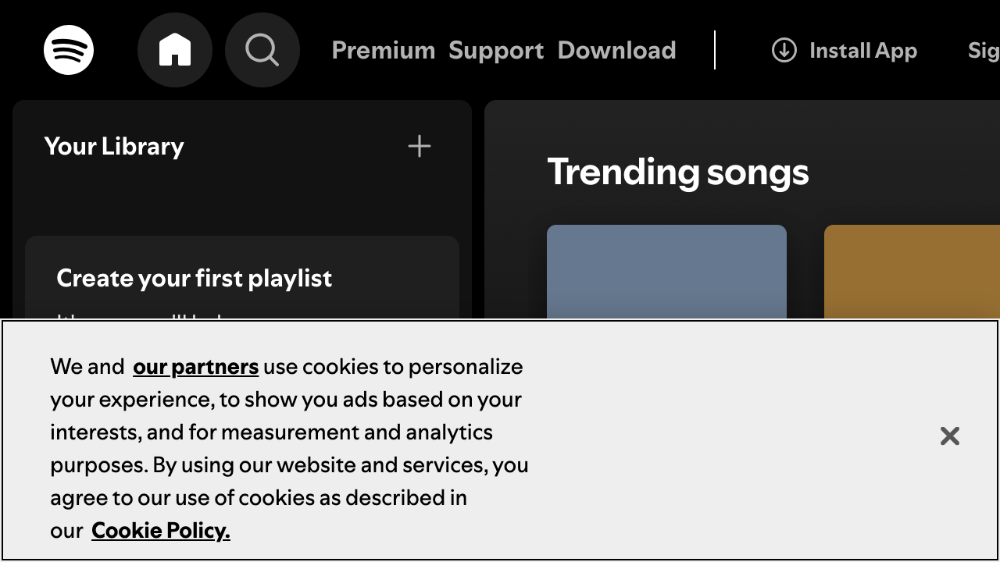

# Accessibility Report

**URL tested**: https://open.spotify.com/  
**Resize Percent**: 200%  
**WCAG SC**: 1.4.4 Resize Text  
**Generated At**: 2025-07-03 00:54:27

---

## ✅ Summary

- **Status**: ❌ Issues found
- **Total issues**: 2
  - ContentLoss: 1
  - HorizontalScroll: 0
  - OverlappingElements: 1

---

## 📸 Screenshots

| Before Resize | After Resize |
| -------------- | ------------- |
|  |  |

---

## 🗂️ Issues Details

### 1️⃣ Type: OverlappingElements

**Description:**  
In the top header, the navigation links 'Premium', 'Support', and 'Download' overlap each other, and the 'Sign up' and 'Log in' buttons are pushed out of view, becoming inaccessible.

**Suggestion:**  
Implement a responsive header that allows items to wrap or collapses them into a hamburger-style menu at larger text sizes to ensure all navigation options remain visible and usable.


---

### 2️⃣ Type: ContentLoss

**Description:**  
In the 'Create your first playlist' section on the left, the descriptive text is cut off horizontally because its container has a fixed height and does not expand with the content.

**Suggestion:**  
Allow containers holding text to expand vertically as text size increases. Use 'min-height' instead of a fixed 'height' property or allow the height to be determined by the content within.


---


## 🗄️ Raw Model Output

<details>
<summary>Click to expand raw JSON output</summary>


```json
{
  "issues": [
    {
      "type": "OverlappingElements",
      "description": "In the top header, the navigation links 'Premium', 'Support', and 'Download' overlap each other, and the 'Sign up' and 'Log in' buttons are pushed out of view, becoming inaccessible.",
      "suggestion": "Implement a responsive header that allows items to wrap or collapses them into a hamburger-style menu at larger text sizes to ensure all navigation options remain visible and usable."
    },
    {
      "type": "ContentLoss",
      "description": "In the 'Create your first playlist' section on the left, the descriptive text is cut off horizontally because its container has a fixed height and does not expand with the content.",
      "suggestion": "Allow containers holding text to expand vertically as text size increases. Use 'min-height' instead of a fixed 'height' property or allow the height to be determined by the content within."
    }
  ]
}
```

</details>
