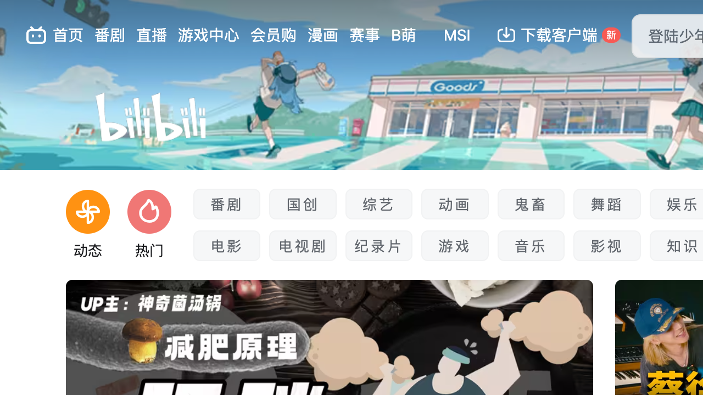

# Accessibility Report

**URL tested**: https://www.bilibili.com/  
**Resize Percent**: 200%  
**WCAG SC**: 1.4.4 Resize Text  
**Generated At**: 2025-07-03 00:56:13

---

## ✅ Summary

- **Status**: ❌ Issues found
- **Total issues**: 1
  - ContentLoss: 1
  - HorizontalScroll: 0
  - OverlappingElements: 0

---

## 📸 Screenshots

| Before Resize | After Resize |
| -------------- | ------------- |
|  |  |

---

## 🗂️ Issues Details

### 1️⃣ Type: ContentLoss

**Description:**  
At 200% text size, the main header navigation links, search bar, and user action buttons (like '登录' and '投稿') are cut off and no longer visible. No alternative, like a hamburger menu, is provided to access this lost functionality.

**Suggestion:**  
Implement a responsive header that reflows content gracefully. When text is enlarged, collapse navigation links and other header elements into a hamburger menu to ensure all functionality remains accessible without being cut off.


---


## 🗄️ Raw Model Output

<details>
<summary>Click to expand raw JSON output</summary>


```json
{
  "issues": [
    {
      "type": "ContentLoss",
      "description": "At 200% text size, the main header navigation links, search bar, and user action buttons (like '\u767b\u5f55' and '\u6295\u7a3f') are cut off and no longer visible. No alternative, like a hamburger menu, is provided to access this lost functionality.",
      "suggestion": "Implement a responsive header that reflows content gracefully. When text is enlarged, collapse navigation links and other header elements into a hamburger menu to ensure all functionality remains accessible without being cut off."
    }
  ]
}
```

</details>
