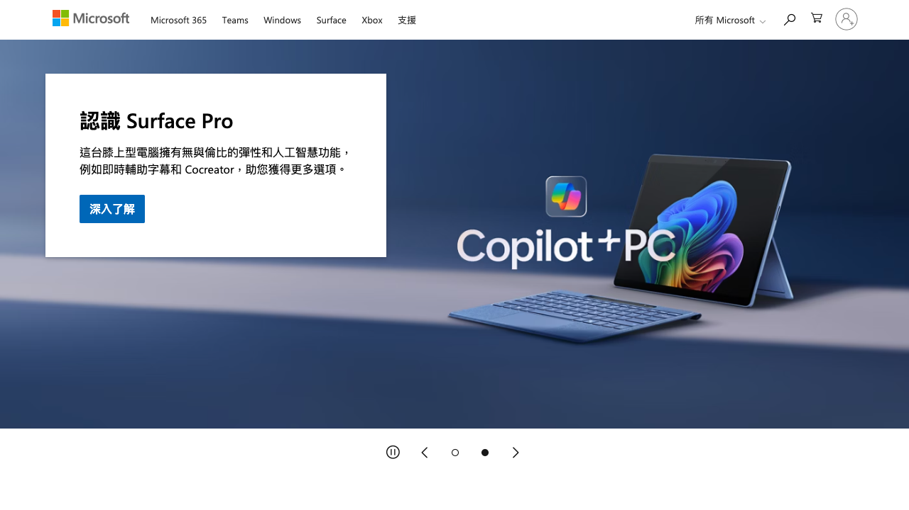
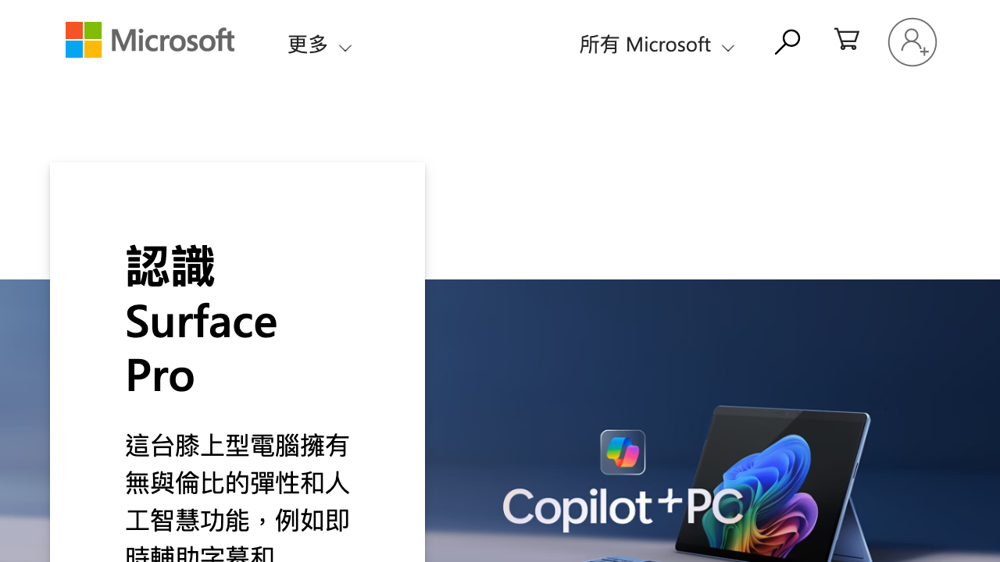

# Accessibility Report

**URL tested**: https://www.microsoft.com/  
**Resize Percent**: 200%  
**WCAG SC**: 1.4.4 Resize Text  
**Generated At**: 2025-07-03 00:53:18

---

## ✅ Summary

- **Status**: ❌ Issues found
- **Total issues**: 1
  - ContentLoss: 1
  - HorizontalScroll: 0
  - OverlappingElements: 0

---

## 📸 Screenshots

| Before Resize | After Resize |
| -------------- | ------------- |
|  |  |

---

## 🗂️ Issues Details

### 1️⃣ Type: ContentLoss

**Description:**  
In the main hero section, the container for the text about the 'Surface Pro' does not expand when the text size is increased. This causes the descriptive text to be clipped and the 'Learn More' button to be completely hidden.

**Suggestion:**  
Ensure the container's height adjusts to fit its content. Avoid using fixed heights and instead allow the container to grow, for example by using `min-height` or `height: auto`.


---


## 🗄️ Raw Model Output

<details>
<summary>Click to expand raw JSON output</summary>


```json
{
  "issues": [
    {
      "type": "ContentLoss",
      "description": "In the main hero section, the container for the text about the 'Surface Pro' does not expand when the text size is increased. This causes the descriptive text to be clipped and the 'Learn More' button to be completely hidden.",
      "suggestion": "Ensure the container's height adjusts to fit its content. Avoid using fixed heights and instead allow the container to grow, for example by using `min-height` or `height: auto`."
    }
  ]
}
```

</details>
