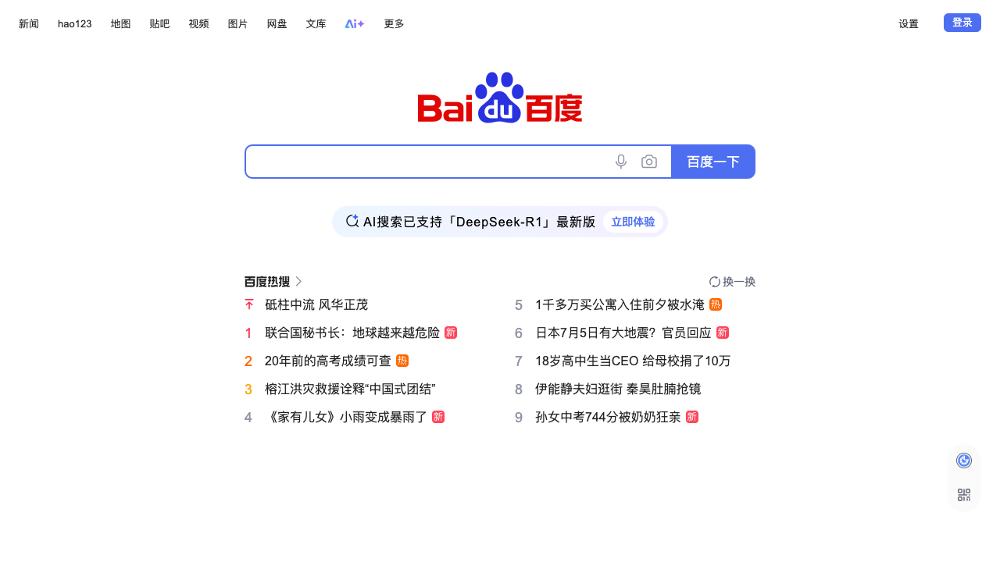
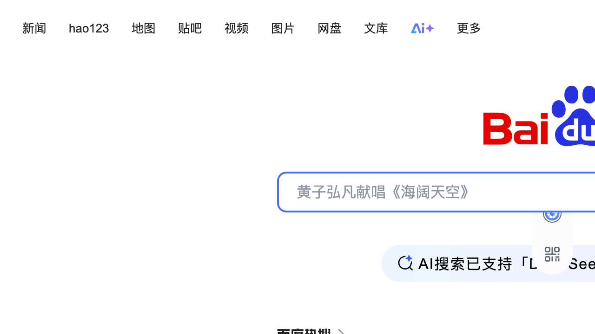

# Accessibility Report

**URL tested**: https://baidu.com/  
**Resize Percent**: 200%  
**WCAG SC**: 1.4.4 Resize Text  
**Generated At**: 2025-07-02 20:52:36

---

## ✅ Summary

- **Status**: ❌ Issues found
- **Total issues**: 4
  - ContentLoss: 3
  - HorizontalScroll: 0
  - OverlappingElements: 1

---

## 📸 Screenshots

| Before Resize | After Resize |
| -------------- | ------------- |
|  |  |

---

## 🗂️ Issues Details

### 1️⃣ Type: ContentLoss

**Description:**  
Navigation links 'Ai+' and '更多' in the top right corner are truncated or completely missing from the visible viewport.

**Suggestion:**  
Implement a flexible navigation bar that allows items to wrap, condense, or use a responsive design pattern (e.g., a hamburger menu) when space is limited due to text resizing. Use relative units for sizing and spacing.


---

### 2️⃣ Type: ContentLoss

**Description:**  
The placeholder text '黄子弘凡献唱《海阔天空》' inside the search input field is truncated, with the final character '>' being cut off.

**Suggestion:**  
Ensure the search input field's width is responsive and can accommodate larger text sizes, possibly by allowing the text to wrap or by dynamically increasing the input's width when text is zoomed.


---

### 3️⃣ Type: ContentLoss

**Description:**  
The informative text 'AI搜索已支持「L' and the word 'See' are truncated, losing content to the right.

**Suggestion:**  
Use a flexible container for this text block that allows text to wrap or adjust its layout dynamically to accommodate increased text size without truncation.


---

### 4️⃣ Type: OverlappingElements

**Description:**  
An icon to the right of the search bar is partially clipped at its bottom and right edges, indicating a layout issue.

**Suggestion:**  
Ensure all UI elements use relative sizing and are placed within a flexible layout that prevents clipping or overlap when text is resized. Provide sufficient padding or margins around interactive elements.


---


## 🗄️ Raw Model Output

<details>
<summary>Click to expand raw JSON output</summary>


```json
{
  "issues": [
    {
      "type": "ContentLoss",
      "description": "Navigation links 'Ai+' and '\u66f4\u591a' in the top right corner are truncated or completely missing from the visible viewport.",
      "suggestion": "Implement a flexible navigation bar that allows items to wrap, condense, or use a responsive design pattern (e.g., a hamburger menu) when space is limited due to text resizing. Use relative units for sizing and spacing."
    },
    {
      "type": "ContentLoss",
      "description": "The placeholder text '\u9ec4\u5b50\u5f18\u51e1\u732e\u5531\u300a\u6d77\u9614\u5929\u7a7a\u300b' inside the search input field is truncated, with the final character '>' being cut off.",
      "suggestion": "Ensure the search input field's width is responsive and can accommodate larger text sizes, possibly by allowing the text to wrap or by dynamically increasing the input's width when text is zoomed."
    },
    {
      "type": "ContentLoss",
      "description": "The informative text 'AI\u641c\u7d22\u5df2\u652f\u6301\u300cL' and the word 'See' are truncated, losing content to the right.",
      "suggestion": "Use a flexible container for this text block that allows text to wrap or adjust its layout dynamically to accommodate increased text size without truncation."
    },
    {
      "type": "OverlappingElements",
      "description": "An icon to the right of the search bar is partially clipped at its bottom and right edges, indicating a layout issue.",
      "suggestion": "Ensure all UI elements use relative sizing and are placed within a flexible layout that prevents clipping or overlap when text is resized. Provide sufficient padding or margins around interactive elements."
    }
  ]
}
```

</details>
