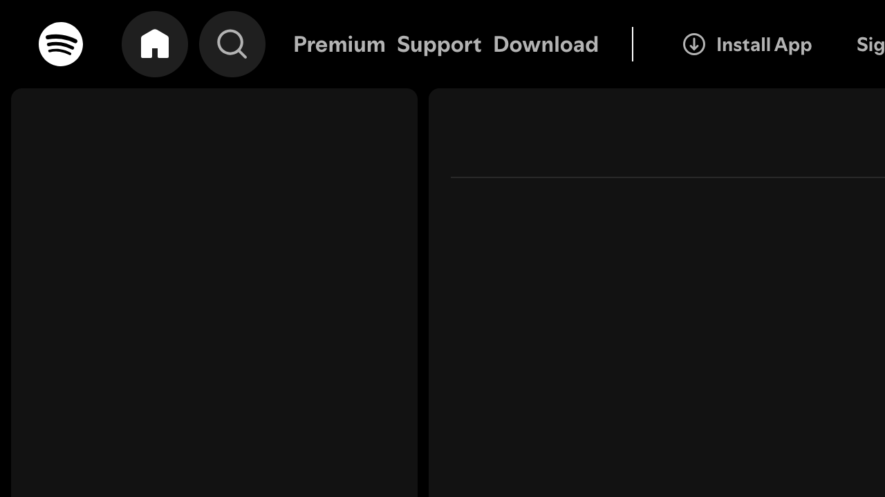

# Accessibility Report

**URL tested**: https://open.spotify.com/  
**Resize Percent**: 200%  
**WCAG SC**: 1.4.4 Resize Text  
**Generated At**: 2025-07-02 20:51:53

---

## ✅ Summary

- **Status**: ❌ Issues found
- **Total issues**: 2
  - ContentLoss: 1
  - HorizontalScroll: 1
  - OverlappingElements: 0

---

## 📸 Screenshots

| Before Resize | After Resize |
| -------------- | ------------- |
|  |  |

---

## 🗂️ Issues Details

### 1️⃣ Type: ContentLoss

**Description:**  
The navigation item on the far right, which appears to be 'Sign Up' or 'Sign In', is truncated, showing only 'Sig' and is cut off by the edge of the viewport.

**Suggestion:**  
Ensure that text content, especially within navigation menus, can wrap or that the layout adjusts to prevent truncation and loss of information when text is resized. Consider using flexible layouts or a responsive breakpoint to convert the navigation into a more compact format (e.g., a hamburger menu) at larger text sizes.


---

### 2️⃣ Type: HorizontalScroll

**Description:**  
The truncation of the 'Sign Up/In' navigation item indicates that content extends beyond the visible viewport horizontally, requiring horizontal scrolling to access the full text.

**Suggestion:**  
Implement a fluid or responsive layout that adapts to text resizing by allowing elements to wrap, stack, or condense, thereby preventing the need for horizontal scrolling at 200% text zoom.


---


## 🗄️ Raw Model Output

<details>
<summary>Click to expand raw JSON output</summary>


```json
{
  "issues": [
    {
      "type": "ContentLoss",
      "description": "The navigation item on the far right, which appears to be 'Sign Up' or 'Sign In', is truncated, showing only 'Sig' and is cut off by the edge of the viewport.",
      "suggestion": "Ensure that text content, especially within navigation menus, can wrap or that the layout adjusts to prevent truncation and loss of information when text is resized. Consider using flexible layouts or a responsive breakpoint to convert the navigation into a more compact format (e.g., a hamburger menu) at larger text sizes."
    },
    {
      "type": "HorizontalScroll",
      "description": "The truncation of the 'Sign Up/In' navigation item indicates that content extends beyond the visible viewport horizontally, requiring horizontal scrolling to access the full text.",
      "suggestion": "Implement a fluid or responsive layout that adapts to text resizing by allowing elements to wrap, stack, or condense, thereby preventing the need for horizontal scrolling at 200% text zoom."
    }
  ]
}
```

</details>
