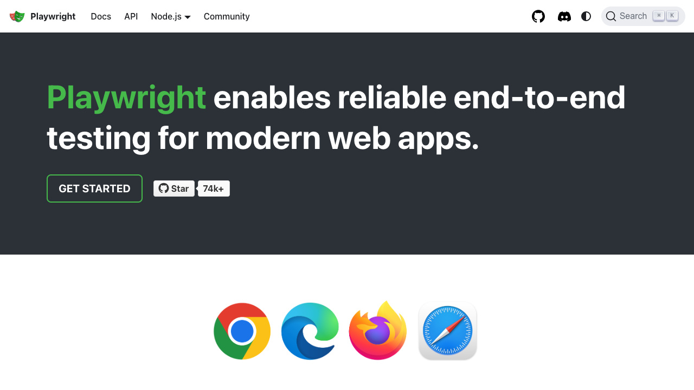
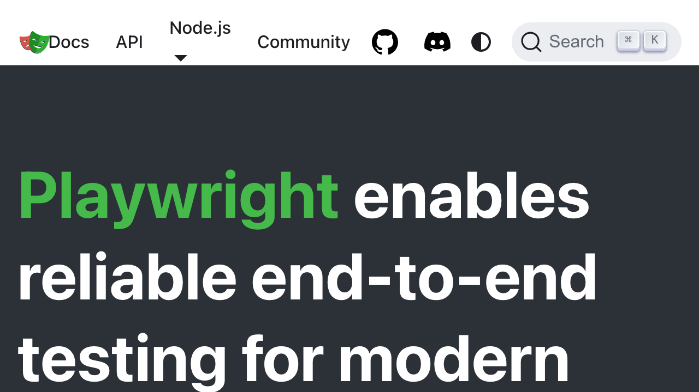

# Accessibility Report

**URL tested**: https://playwright.dev/  
**Resize Percent**: 200%  
**WCAG SC**: 1.4.4 Resize Text  
**Generated At**: 2025-07-02 20:51:15

---

## ✅ Summary

- **Status**: ❌ Issues found
- **Total issues**: 2
  - ContentLoss: 1
  - HorizontalScroll: 1
  - OverlappingElements: 0

---

## 📸 Screenshots

| Before Resize | After Resize |
| -------------- | ------------- |
|  |  |

---

## 🗂️ Issues Details

### 1️⃣ Type: ContentLoss

**Description:**  
Significant portions of the main heading text (e.g., 'Playwright', 'enables', 'reliable', 'end-to-end', 'testing', 'modern') are truncated horizontally, making them unreadable without horizontal scrolling.

**Suggestion:**  
Ensure text containers use relative units (e.g., em, rem, %) for width and font-size, and allow text to wrap to new lines. Implement flexible layouts (e.g., Flexbox, Grid) that adapt to increased text size without truncation.


---

### 2️⃣ Type: HorizontalScroll

**Description:**  
Horizontal scrolling is introduced to view the full main heading text due to lines being truncated rather than wrapping, violating the 200% text zoom requirement.

**Suggestion:**  
Design the layout to be fluid and allow text to wrap naturally when font size increases, avoiding fixed-width containers that force horizontal overflow. Use CSS properties like `word-wrap: break-word` or `overflow-wrap: break-word` if necessary.


---


## 🗄️ Raw Model Output

<details>
<summary>Click to expand raw JSON output</summary>


```json
{
  "issues": [
    {
      "type": "ContentLoss",
      "description": "Significant portions of the main heading text (e.g., 'Playwright', 'enables', 'reliable', 'end-to-end', 'testing', 'modern') are truncated horizontally, making them unreadable without horizontal scrolling.",
      "suggestion": "Ensure text containers use relative units (e.g., em, rem, %) for width and font-size, and allow text to wrap to new lines. Implement flexible layouts (e.g., Flexbox, Grid) that adapt to increased text size without truncation."
    },
    {
      "type": "HorizontalScroll",
      "description": "Horizontal scrolling is introduced to view the full main heading text due to lines being truncated rather than wrapping, violating the 200% text zoom requirement.",
      "suggestion": "Design the layout to be fluid and allow text to wrap naturally when font size increases, avoiding fixed-width containers that force horizontal overflow. Use CSS properties like `word-wrap: break-word` or `overflow-wrap: break-word` if necessary."
    }
  ]
}
```

</details>
