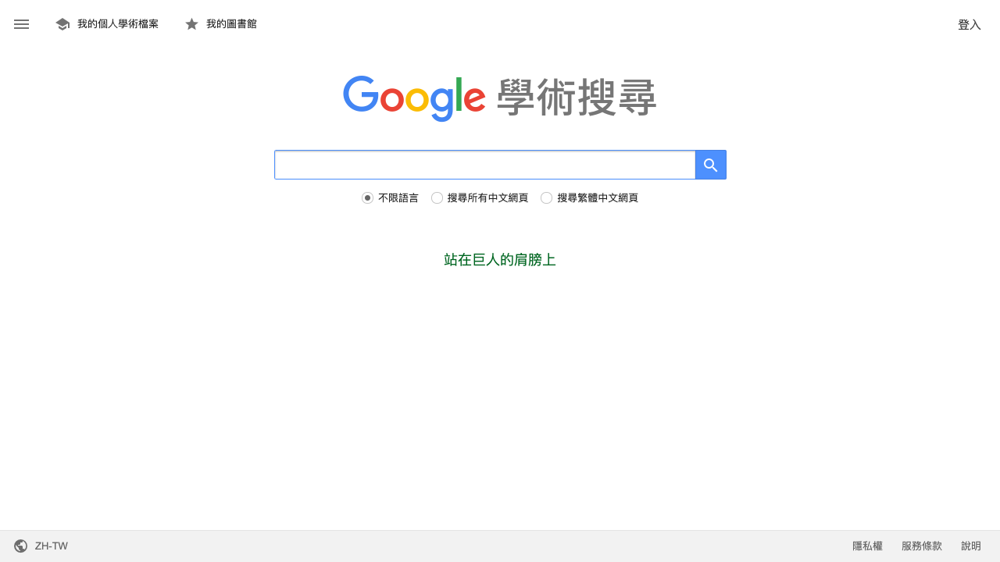
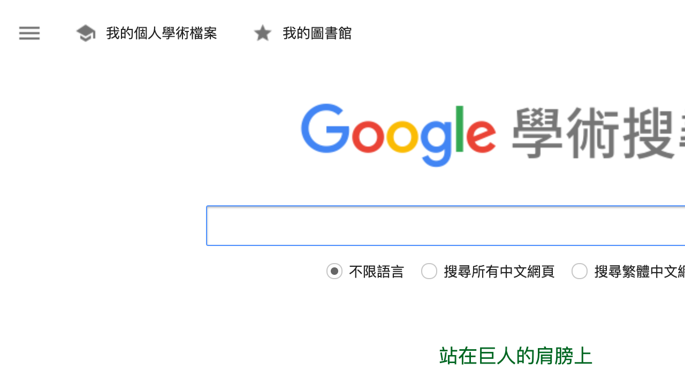

# Accessibility Report

**URL tested**: https://scholar.google.com/  
**Resize Percent**: 200%  
**WCAG SC**: 1.4.4 Resize Text  
**Generated At**: 2025-07-02 20:50:50

---

## ✅ Summary

- **Status**: ❌ Issues found
- **Total issues**: 1
  - ContentLoss: 0
  - HorizontalScroll: 1
  - OverlappingElements: 0

---

## 📸 Screenshots

| Before Resize | After Resize |
| -------------- | ------------- |
|  |  |

---

## 🗂️ Issues Details

### 1️⃣ Type: HorizontalScroll

**Description:**  
The label for the third radio button, '搜尋繁體中文網頁', is truncated on the right side, requiring horizontal scrolling to view the full text and the associated radio button.

**Suggestion:**  
Ensure content containers use flexible widths or allow text to wrap to multiple lines when zoomed. Use relative units for spacing and element widths to prevent overflow and the introduction of horizontal scrollbars at increased text sizes.


---


## 🗄️ Raw Model Output

<details>
<summary>Click to expand raw JSON output</summary>


```json
{
  "issues": [
    {
      "type": "HorizontalScroll",
      "description": "The label for the third radio button, '\u641c\u5c0b\u7e41\u9ad4\u4e2d\u6587\u7db2\u9801', is truncated on the right side, requiring horizontal scrolling to view the full text and the associated radio button.",
      "suggestion": "Ensure content containers use flexible widths or allow text to wrap to multiple lines when zoomed. Use relative units for spacing and element widths to prevent overflow and the introduction of horizontal scrollbars at increased text sizes."
    }
  ]
}
```

</details>
