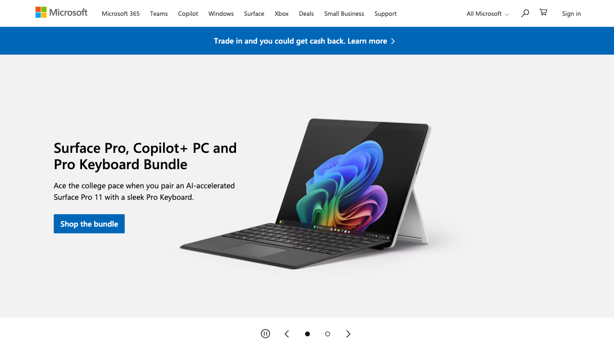
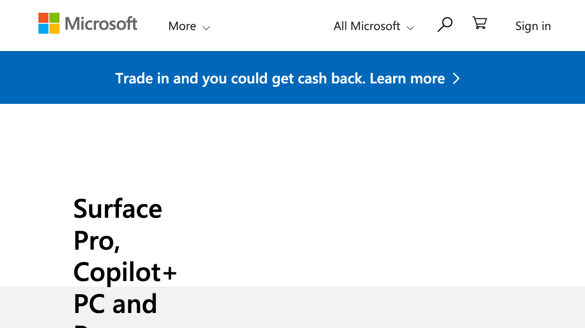

# Accessibility Report

**URL tested**: https://www.microsoft.com/en-us/  
**Resize Percent**: 200%  
**WCAG SC**: 1.4.4 Resize Text  
**Generated At**: 2025-07-02 20:51:36

---

## ✅ Summary

- **Status**: ❌ Issues found
- **Total issues**: 1
  - ContentLoss: 0
  - HorizontalScroll: 1
  - OverlappingElements: 0

---

## 📸 Screenshots

| Before Resize | After Resize |
| -------------- | ------------- |
|  |  |

---

## 🗂️ Issues Details

### 1️⃣ Type: HorizontalScroll

**Description:**  
The text in the blue promotional banner ('Trade in and you could get cash back. Learn more') is truncated on the right side, requiring horizontal scrolling to view the entire content. This indicates that the layout does not adapt sufficiently when text is resized to 200%.

**Suggestion:**  
Implement a flexible layout for the banner content, allowing the text to wrap to multiple lines or resize responsively when the text zoom level increases. Avoid fixed-width containers and use relative units (e.g., em, rem, vw) to ensure content adapts to available space.


---


## 🗄️ Raw Model Output

<details>
<summary>Click to expand raw JSON output</summary>


```json
{
  "issues": [
    {
      "type": "HorizontalScroll",
      "description": "The text in the blue promotional banner ('Trade in and you could get cash back. Learn more') is truncated on the right side, requiring horizontal scrolling to view the entire content. This indicates that the layout does not adapt sufficiently when text is resized to 200%.",
      "suggestion": "Implement a flexible layout for the banner content, allowing the text to wrap to multiple lines or resize responsively when the text zoom level increases. Avoid fixed-width containers and use relative units (e.g., em, rem, vw) to ensure content adapts to available space."
    }
  ]
}
```

</details>
