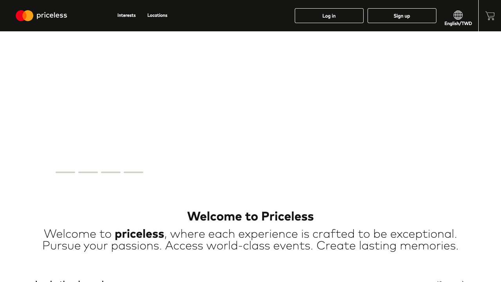
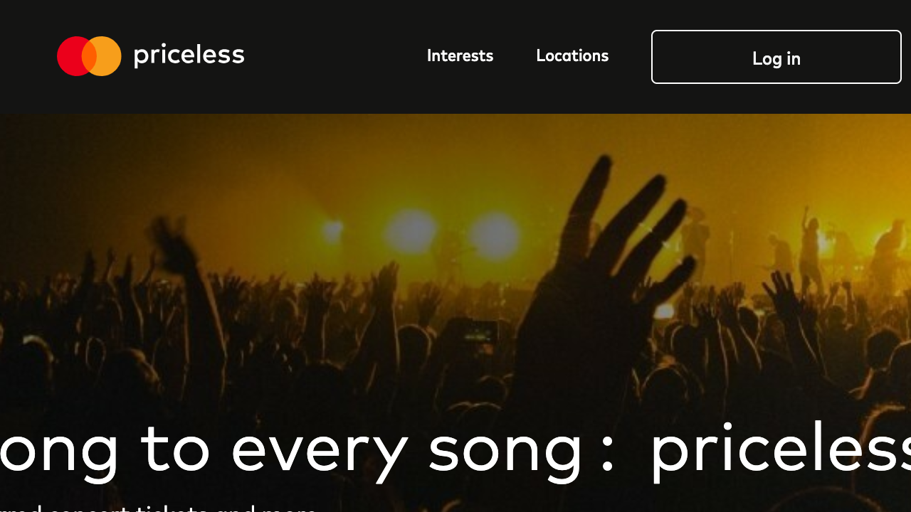

# Accessibility Report

**URL tested**: https://www.priceless.com/  
**Resize Percent**: 200%  
**WCAG SC**: 1.4.4 Resize Text  
**Generated At**: 2025-07-02 20:50:32

---

## ✅ Summary

- **Status**: ❌ Issues found
- **Total issues**: 2
  - ContentLoss: 2
  - HorizontalScroll: 0
  - OverlappingElements: 0

---

## 📸 Screenshots

| Before Resize | After Resize |
| -------------- | ------------- |
|  |  |

---

## 🗂️ Issues Details

### 1️⃣ Type: ContentLoss

**Description:**  
The main headline text (e.g., 'Sing along to every song : priceless') is truncated on the left side, with part of the text being cut off and not visible.

**Suggestion:**  
Ensure text containers use flexible units (e.g., percentages, `em`, `rem`, `vw`) and allow for content to wrap or scale down gracefully when text size is increased. Avoid fixed-width containers that do not account for text enlargement.


---

### 2️⃣ Type: ContentLoss

**Description:**  
The descriptive text below the headline (e.g., 'Unformed concert tickets and more') is truncated on the left side, with part of the text being cut off and not visible.

**Suggestion:**  
Implement a more robust responsive design that accommodates text resizing. Use relative units for widths and padding, and consider `min-width` or `max-width` properties along with `word-wrap: break-word` or similar for long strings to prevent truncation.


---


## 🗄️ Raw Model Output

<details>
<summary>Click to expand raw JSON output</summary>


```json
{
  "issues": [
    {
      "type": "ContentLoss",
      "description": "The main headline text (e.g., 'Sing along to every song : priceless') is truncated on the left side, with part of the text being cut off and not visible.",
      "suggestion": "Ensure text containers use flexible units (e.g., percentages, `em`, `rem`, `vw`) and allow for content to wrap or scale down gracefully when text size is increased. Avoid fixed-width containers that do not account for text enlargement."
    },
    {
      "type": "ContentLoss",
      "description": "The descriptive text below the headline (e.g., 'Unformed concert tickets and more') is truncated on the left side, with part of the text being cut off and not visible.",
      "suggestion": "Implement a more robust responsive design that accommodates text resizing. Use relative units for widths and padding, and consider `min-width` or `max-width` properties along with `word-wrap: break-word` or similar for long strings to prevent truncation."
    }
  ]
}
```

</details>
